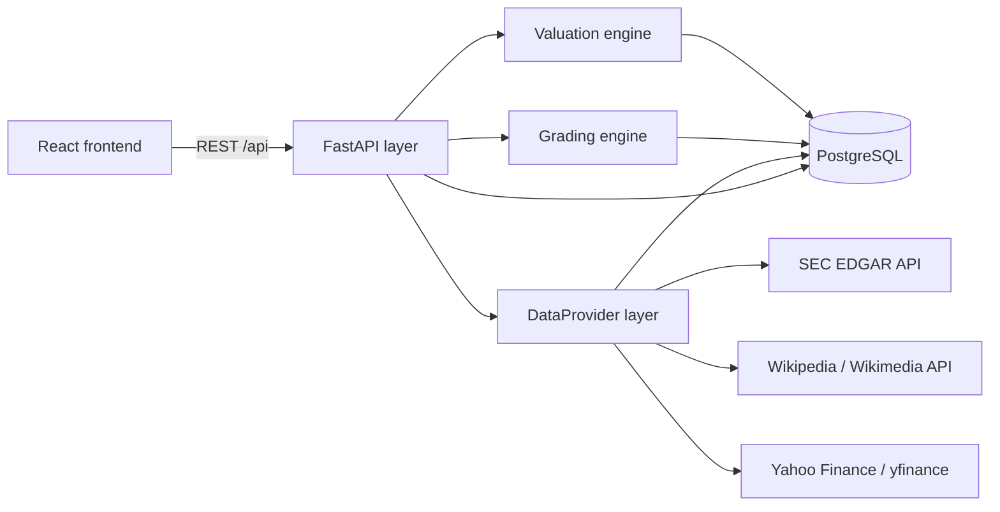

# Stock Analyzer

A backend-driven application that automates multi-model fundamental equity
valuation. It ingests company financial statements, runs them through several
independent valuation models and a composite grading engine, and stores
timestamped, immutable snapshots so every analysis is reproducible after the
fact. A React frontend provides the data-entry grids, parameter panels, charts,
and portfolio views on top of the API.

The goal is to take a ticker, pull its public fundamentals, and produce a
defensible fair-value range and quality grade — with every input and assumption
recorded — rather than a single opaque number.

## Features

- **Multiple valuation models** — P/E, price-to-book, EV/EBITDA, EV/EBIT, and
  EV/FCF, each driven by configurable, reusable parameter templates. Every
  model's fair value is combined into an average/median with upside vs. the
  current price.
- **Composite grading** — an aggregate grade built from sub-scores for
  profitability, financial strength, valuation, growth, efficiency, safety,
  and dividend.
- **Growth & derived metrics** — per-quarter and TTM derivations (EPS, margins,
  free cash flow, CAGRs) computed from the raw statement data.
- **Immutable snapshots** — timestamped, append-only captures of a stock's
  inputs, parameters, and results, so historical analyses never change underfoot.
- **Pluggable data layer** — financial data is fetched through swappable
  provider adapters, so adding or replacing a source is local to one module.
- **Background jobs** — long-running portfolio-wide fetch/analyze tasks run as
  tracked background jobs with status reporting.

## Tech stack

| Layer     | Technology                                        |
| --------- | ------------------------------------------------- |
| API       | FastAPI (Python 3.11+)                             |
| ORM       | SQLAlchemy 2.x                                     |
| Migrations| Alembic                                           |
| Database  | PostgreSQL                                         |
| Frontend  | React + TypeScript, Vite, TanStack Query, Recharts |

## Architecture



- **API layer** (`backend/app/api`) — FastAPI routers for stocks, financials,
  parameters, valuations, grading, snapshots, jobs, and portfolio, all under
  `/api`.
- **Valuation engine** (`backend/app/services/valuations`) — each model is a
  self-contained module registered in a small registry, so models compose and
  are added independently.
- **Grading engine** (`backend/app/services/grading`) — scores individual
  metrics, then aggregates them into category sub-grades and a composite grade.
- **DataProvider layer** (`backend/app/services`) — each external source sits
  behind its own adapter, keeping fetch logic isolated from the rest of the app.
- **Persistence** — SQLAlchemy 2.x models with Alembic-managed schema
  migrations against PostgreSQL.

## Data sources

The application uses only public data:

- **SEC EDGAR** — company fundamentals via the official `data.sec.gov` XBRL
  `companyfacts` API (a descriptive `User-Agent` is sent, as SEC requires).
- **Wikipedia** — S&P 500 constituent list via the Wikimedia API.
- **Yahoo Finance** — market prices and beta via the `yfinance` library.

## Getting started

### Prerequisites

- Python 3.11+
- Node.js 18+
- PostgreSQL 14+

### 1. Backend

```bash
cd backend

# create and activate a virtual environment
python -m venv .venv
source .venv/bin/activate        # Windows: .venv\Scripts\activate

# install (use ".[dev]" for the test/lint toolchain)
pip install -e .

# configure environment
cp .env.example .env             # then edit values as needed

# create the database schema
alembic upgrade head

# run the API (http://localhost:8000, interactive docs at /docs)
uvicorn app.main:app --reload
```

Configuration is read from environment variables / `.env`. See
[`backend/.env.example`](backend/.env.example) for the full list — at minimum
you'll set `DATABASE_URL` (your PostgreSQL connection string) and a contact
`User-Agent` for the SEC EDGAR requests.

### 2. Frontend

```bash
cd frontend
npm install
npm run dev                      # http://localhost:5173
```

The frontend talks to the backend at `http://localhost:8000` and expects the
API's CORS origin to include the Vite dev server (`http://localhost:5173`, the
default).

## Project structure

```
backend/
  app/
    api/          FastAPI routers
    core/         configuration
    db/           SQLAlchemy models + session
    services/     valuation, grading, growth, data providers, jobs
  alembic/        database migrations
  tests/          pytest suite
frontend/
  src/            React app (pages, features, components, API client)
```

## Notes / limitations

- This is a personal/portfolio project, not investment advice. Valuation
  outputs depend entirely on user-supplied assumptions and parameter templates.
- All data comes from free, public sources. Those sources can be incomplete,
  delayed, or occasionally unavailable, and the app surfaces whatever resolves
  rather than guaranteeing a full dataset.
- There is no authentication; it is designed to run locally as a single-user
  tool.
- Fundamental data quality varies by filer and by how each company tags its
  XBRL concepts, so derived figures should be sanity-checked before use.
